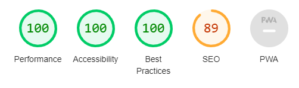
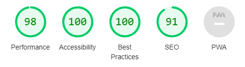

# **Online Calculator**
**[View the live project here!](https://sbnn3.github.io/online-calculator/)**

Here is the online calculator that you can use direct in the browser.
The calculator functions are fully working, use it for free. 

# **User Experience (UX)**
<ul>
<li><h3>User Stories</h3></li>
<ul>
<li><h3>User Goals & Testing</h3></li>
<ol type="1">
<li>As a user, i would like to use the calculator much as i can. </li>
<ul><li>The calculator is able to calculate any type of maths operation. You can use it much as you would like to.</li></ul>
<li>As a user, i would like to understood exactly what kind functions had the calculator.</li>
<ul><li>The calculator have all functions that are requited.</li></ul>
<li>As a user, i would like to delete the digits one by one.</li>
<ul><li>The DEL button allow you to delete the digits one by one.</li></ul>
<li>As a user, i would like to use calculator in difficult maths operation.</li>
<ul><li>The calculator can help you to solve the most difficult maths operation.</li></ul>
</ol>
</ul>
</ul>

<ul>
<li><h2>User Goals</h2></li>
<ul>
<li>The website is fully functionable and easy to access.</li>
<li>The Calculator Buttons are clearly and functionable. </li>
<li>The website is working on different screen sizes, desktop, tablets and mobile phones.</li>
</ul>
</ul>

# **Design**
<ul>
<li>Colour Scheme</li>
<ul>
<li>The website colours used is Gray, Black and White.</li>
</ul></ul>
<ul>
<li>Typography</li>
<ul>
<li>The Noto Serif font is the main font used throughout the website. The font was imported from Google fonts.</li></ul></ul>

# **Testing**
<ul>
<li>The website works in different browsers: Chrome, Firefox, Safari.</li>
<li>I confirm that the website is fully operational and looks good.</li></ul>

# **Languages Used**
<ul>
<li><a href="https://en.wikipedia.org/wiki/HTML">HTML</a></li>
<li><a href="https://en.wikipedia.org/wiki/CSS">CSS</a></li>
<li><a href="https://en.wikipedia.org/wiki/JavaScript">JavaScript</a></li>
</ul>

# **Validator Testing**
<ul>
<li>
HTML - No errors were returned when passing through the official W3C Validator.</li>
<li>CSS - No errors were returned when passing through the official (Jigsaw) Validator.</li>
<li>JavaScript - No errors were returned when passing through the official JS Valdiator.</li>
</ul>

# **Deployment**
### **GitHub Pages**

The project was deployed to GitHub pages using the following steps...

<ol type="1">
<li>Log in to GitHub and locate the <a href="https://github.com/sbnn3/online-calculator">GitHub Online Calculator Project</a></li>
<li>At the top of the Repository (not top of page), locate the "Settings" Button on the menu.</li>
<li>Scroll down the Settings page until you locate the "GitHub Pages" Section.</li>
<li>Under "Source", click the dropdown called "None" and select "main".</li>
<li>The page will automatically refresh.</li>
<li>Scroll back down through the page to locate the now published site <a href="https://sbnn3.github.io/online-calculator/">link</a> in the "GitHub Pages" section.</li></ol>

# **Accesibility**
### **Desktop** 

### **Mobile** 

# **Media**
<ul>
<li>
The website background was taken from <a href="https://www.pexels.com/">Pexels</a></li></ul>

# **Content**
<ul>
<li>
All website content was written by Sebastian Neagu.</li></ul>

# **Acknowledgements**
<ul>
<li>My mentor Gerard McBride for continuous helpful feedback.</li>
<li>Tutor support at Code Institute for their support.</li></ul>
